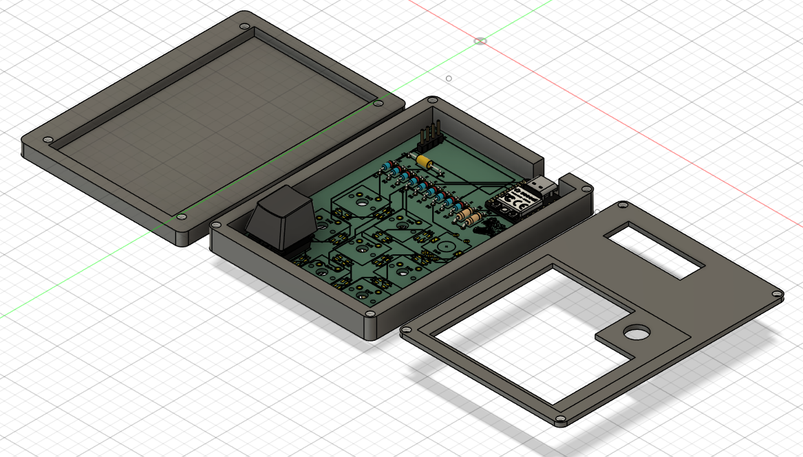
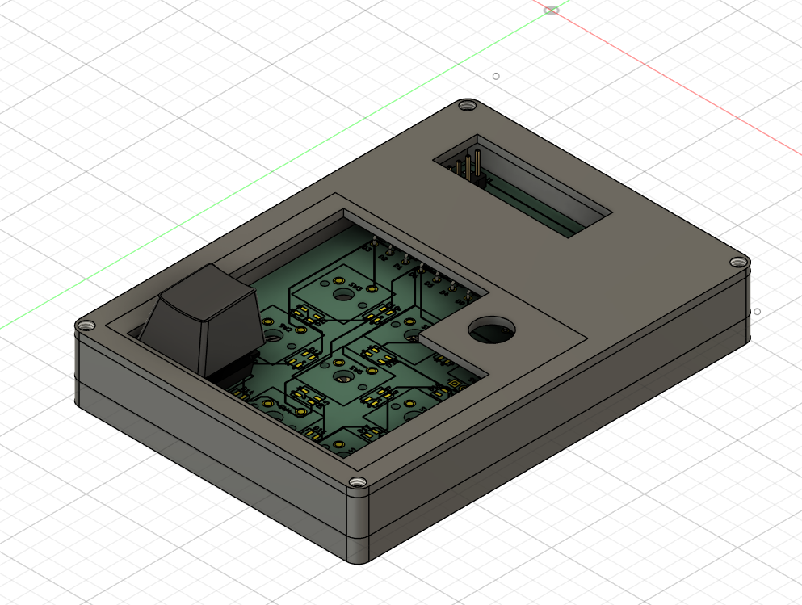
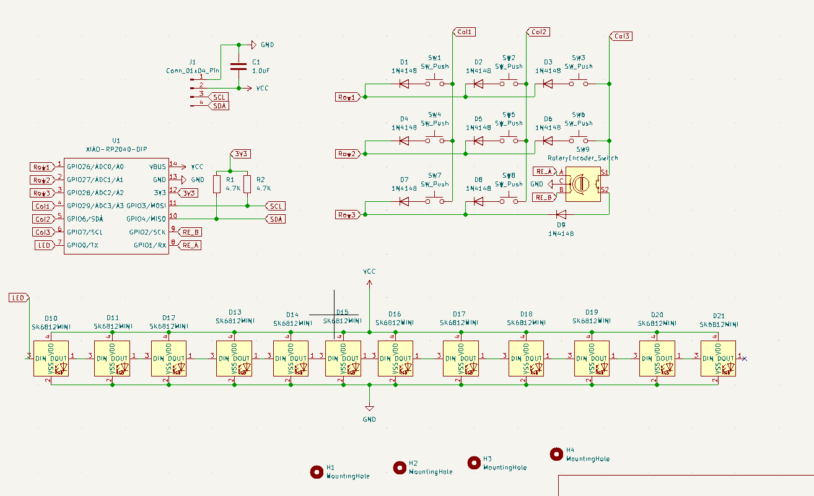
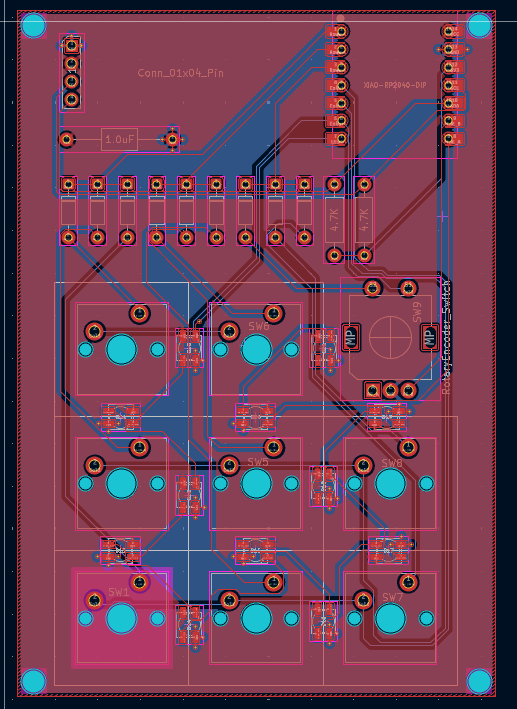
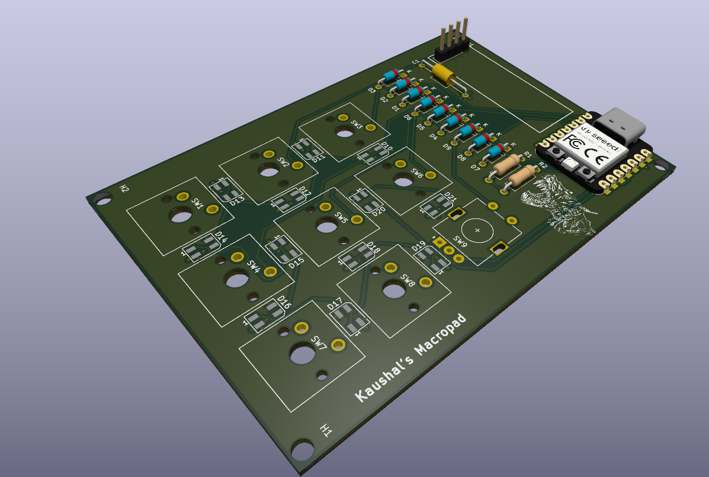

# macropad

BOM:
|Reference                                      |Qty|Value               |DNP|Exclude from BOM |Exclude from Board|Footprint                                                     |Datasheet                                                                 |
|-----------------------------------------------|---|--------------------|---|-----------------|------------------|--------------------------------------------------------------|--------------------------------------------------------------------------|
|C1                                             |1  |1.0uF               |   |                 |                  |Capacitor_THT:C_Axial_L5.1mm_D3.1mm_P15.00mm_Horizontal       |~                                                                         |
|D1,D2,D3,D4,D5,D6,D7,D8,D9                     |9  |1N4148              |   |                 |                  |Diode_THT:D_DO-35_SOD27_P7.62mm_Horizontal                    |https://assets.nexperia.com/documents/data-sheet/1N4148_1N4448.pdf        |
|D10,D11,D12,D13,D14,D15,D16,D17,D18,D19,D20,D21|12 |SK6812MINI          |   |                 |                  |LED_SMD:LED_SK6812MINI_PLCC4_3.5x3.5mm_P1.75mm                |https://cdn-shop.adafruit.com/product-files/2686/SK6812MINI_REV.01-1-2.pdf|
|H1,H2,H3,H4                                    |4  |MountingHole        |   |Excluded from BOM|                  |MountingHole:MountingHole_3.2mm_M3                            |~                                                                         |
|J1                                             |1  |Conn_01x04_Pin      |   |                 |                  |Connector_PinHeader_2.54mm:PinHeader_1x04_P2.54mm_Vertical    |~                                                                         |
|R1,R2                                          |2  |4.7K                |   |                 |                  |Resistor_THT:R_Axial_DIN0207_L6.3mm_D2.5mm_P10.16mm_Horizontal|~                                                                         |
|SW1,SW2,SW3,SW4,SW5,SW6,SW7,SW8                |8  |SW_Push             |   |                 |                  |Button_Switch_Keyboard:SW_Cherry_MX_1.00u_PCB                 |~                                                                         |
|SW9                                            |1  |RotaryEncoder_Switch|   |                 |                  |Rotary_Encoder:RotaryEncoder_Alps_EC11E-Switch_Vertical_H20mm |~                                                                         |
|U1                                             |1  |XIAO-RP2040-DIP     |   |                 |                  |OPL Lib:XIAO-RP2040-DIP                                       |                                                                          |

Resources used:

https://www.thingiverse.com/thing:6940808

https://github.com/ConstantinoSchillebeeckx/cherry-mx-switch/blob/master/switch.step

https://github.com/ConstantinoSchillebeeckx/cherry-mx-keycaps/blob/master/STEP/Cherry%20MX%20keycaps.step

